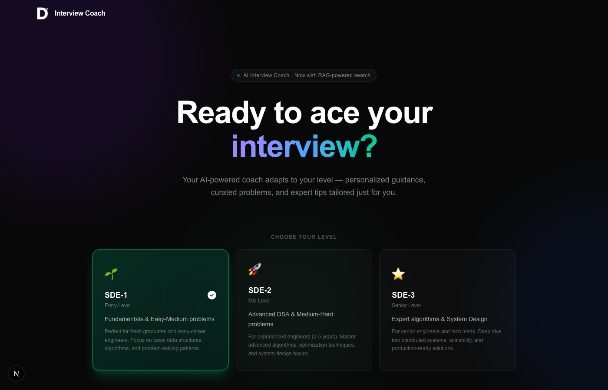
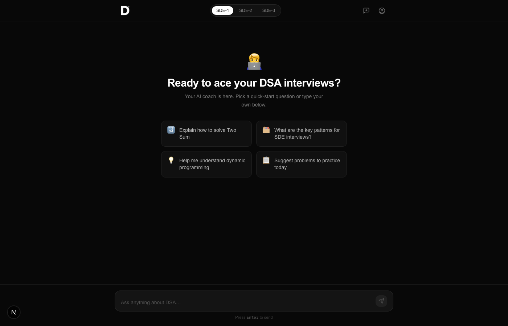
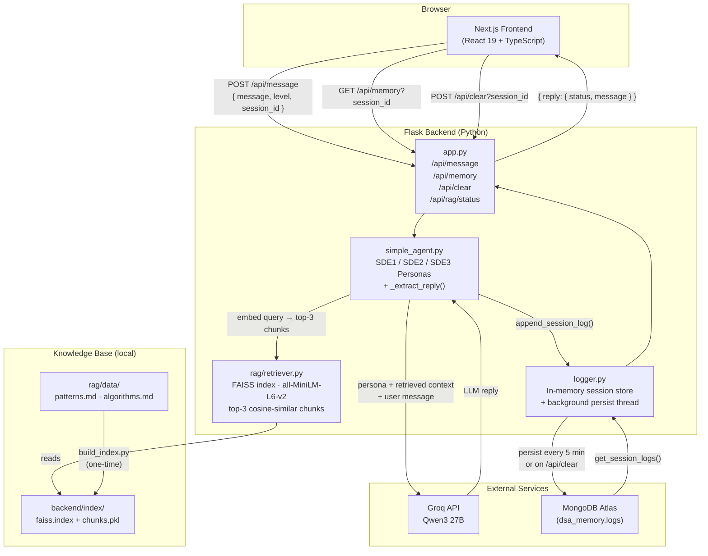

<div align="center">

# 🤖 dBot — DSA Interview Assistant

**An AI-powered coding interview coach that adapts to your seniority level**

[](https://python.org)
[](https://nextjs.org)
[](https://typescriptlang.org)
[](https://mongodb.com)
[](https://groq.com)
[](https://github.com/facebookresearch/faiss)
[](LICENSE)

[**Live Demo**](https://my-dbot.vercel.app) · [Report Bug](https://github.com/divyadhimaan/dsa-progress-chatbot/issues) · [Request Feature](https://github.com/divyadhimaan/dsa-progress-chatbot/issues)

</div>

---

## Overview

dBot is a conversational AI coach for software engineering interview prep. Unlike generic chatbots, it combines two techniques to give grounded, accurate answers:

- **Persona-based prompting** — selects an SDE-1, SDE-2, or SDE-3 coaching style so every response matches the depth and vocabulary of your target role
- **Retrieval-Augmented Generation (RAG)** — before every LLM call, the backend retrieves the most relevant DSA knowledge chunks (patterns, algorithms, complexity tables) from a local FAISS vector store and injects them as context, keeping answers precise and code-accurate

Conversations are persisted per session in MongoDB, so you can pick up where you left off.

---

## Screenshots

### Landing page — level selector


### Chat interface


---

## Features

| Feature | Description |
|---|---|
| 🎯 **Three SDE personas** | Entry, Mid, and Senior coaching styles — different depth, tone, and topic focus |
| 🔍 **RAG pipeline** | FAISS vector store retrieves top-3 relevant DSA chunks per query; gracefully skips if index not built |
| 💬 **Session memory** | Full conversation history persisted to MongoDB; resume anytime |
| 📝 **Rich markdown** | Tables, fenced code blocks, lists, and headings rendered inline via `remark-gfm` |
| 🔄 **Background persistence** | A cron thread flushes in-memory logs to MongoDB every 5 minutes |
| 🌐 **CORS-ready** | Configured for local dev and Vercel production out of the box |

---

## Architecture



**Request lifecycle:**
1. User picks an SDE level and types a message in the chat UI
2. Frontend sends `POST /api/message` with `{ message, level, session_id }`
3. Backend embeds the query with `all-MiniLM-L6-v2` and retrieves the top-3 relevant DSA knowledge chunks from FAISS
4. Retrieved context is injected into the user message; the level-appropriate persona is used as the system prompt
5. Groq runs inference with Qwen3 27B; the `<think>` reasoning block is stripped before the reply is returned
6. The reply is appended to in-memory session logs and returned to the UI
7. A background thread persists all sessions to MongoDB every 5 minutes

---

## Tech Stack

### Frontend
| | Library | Purpose |
|---|---|---|
| ⚛️ | Next.js 19 + React 19 | Framework and rendering |
| 🟦 | TypeScript 5 | Type safety |
| 🎨 | Tailwind CSS v4 + MUI | Styling and UI components |
| 📝 | react-markdown + remark-gfm | Render LLM markdown — tables, code blocks, lists |
| 🔌 | axios | HTTP client for API calls |
| 🔔 | notistack | Toast notifications |

### Backend
| | Library | Purpose |
|---|---|---|
| 🐍 | Flask + flask-cors | Web framework and routing |
| 🤖 | Groq API (HTTP) | Qwen3 27B inference |
| 🔍 | FAISS (`faiss-cpu`) | Vector similarity search |
| 🧠 | sentence-transformers | `all-MiniLM-L6-v2` query embedding |
| 🍃 | pymongo + certifi | MongoDB client with TLS |
| ⚙️ | python-dotenv | Environment configuration |

---

## Getting Started

### Prerequisites

- **Node.js** 18+
- **Python** 3.8+
- **MongoDB** instance — [MongoDB Atlas free tier](https://www.mongodb.com/cloud/atlas) works fine
- **Groq API key** — [get one here](https://console.groq.com) (free)

### 1 — Clone

```bash
git clone https://github.com/divyadhimaan/dsa-progress-chatbot.git
cd dsa-progress-chatbot
```

### 2 — Environment

Create a `.env` file in the **project root**:

```env
# Required
GROQ_API_KEY=your_groq_api_key_here
MONGO_URI=your_mongodb_connection_string

# Optional (defaults to 5001)
BACKEND_PORT=5001
```

### 3 — Install dependencies

```bash
# Backend
pip install -r backend/requirements.txt

# Frontend
cd frontend && npm install
```

### 4 — Build the RAG index

Run once after cloning (and again whenever you add new files to `backend/rag/data/`):

```bash
python3 backend/rag/build_index.py
```

This reads every `.md` / `.txt` file in `backend/rag/data/`, embeds them with `all-MiniLM-L6-v2`, and writes the FAISS index to `backend/index/`. The backend loads it lazily on the first query — no restart needed.

> The `backend/index/` directory is gitignored. If you skip this step, the backend falls back to plain LLM responses without retrieval.

### 5 — Run

Open two terminals:

```bash
# Terminal 1 — backend (from project root)
python3 backend/app.py
```

```bash
# Terminal 2 — frontend
cd frontend && npm run dev
```

Visit **[http://localhost:3000](http://localhost:3000)** — the backend runs on port 5001.

---

## SDE Personas

Each level selects a distinct system prompt that shapes the depth, vocabulary, and expectations of every response.

<details>
<summary><strong>SDE-1 · Entry Level</strong> (fresh grads, 0–2 yrs)</summary>

**Topics:** Arrays, Strings, Linked Lists, Stacks, Queues, Hash Tables, Basic Trees/Graphs, Sorting, Big-O basics, Easy–Medium LeetCode

**Style:** Patient and encouraging — breaks problems into small steps, uses analogies, gives hints before full solutions, celebrates progress.
</details>

<details>
<summary><strong>SDE-2 · Mid Level</strong> (2–5 yrs experience)</summary>

**Topics:** Advanced Trees, Dijkstra/Bellman-Ford, Union-Find, Dynamic Programming, KMP/Trie, Sliding Window, Greedy, Bit Manipulation, Medium–Hard LeetCode, basic System Design

**Style:** Technical and trade-off-focused — discusses multiple solutions, optimizes for time/space, challenges edge-case thinking.
</details>

<details>
<summary><strong>SDE-3 · Senior Level</strong> (5+ yrs, staff/principal track)</summary>

**Topics:** Advanced DP (bitmask, state machine), Network Flow, Fenwick Trees, Suffix Arrays, Computational Geometry, Hard/Expert LeetCode, Distributed Systems, Architecture, Production trade-offs

**Style:** Expert peer — expects optimal solutions upfront, debates architecture decisions, discusses failure modes and scalability at scale.
</details>

---

## RAG Knowledge Base

The vector store is seeded from Markdown files in `backend/rag/data/`:

| File | Contents |
|---|---|
| `patterns.md` | 12 patterns — sliding window, two pointers, fast/slow pointers, BFS/DFS, backtracking, 0/1 knapsack, LCS, LIS, heap, monotonic stack, union-find, trie, topological sort |
| `algorithms.md` | Sorting algorithms + complexity table, Dijkstra / Bellman-Ford / Floyd-Warshall / Kruskal / Prim, tree operations, KMP / Rabin-Karp, bit manipulation tricks, back-of-envelope estimates, system design fundamentals |

**Adding more knowledge:** drop any `.md` or `.txt` file into `backend/rag/data/` and re-run:

```bash
python3 backend/rag/build_index.py
```

The index hot-reloads on the next backend restart.

---

## API Reference

### `POST /api/message`
Send a message and receive an AI reply.

**Request body:**
```json
{
  "message": "Explain binary search",
  "level": "SDE1",
  "session_id": "550e8400-e29b-41d4-a716-446655440000"
}
```

**Response:**
```json
{
  "reply": {
    "status": "ok",
    "message": "Binary search divides the search space in half each iteration..."
  }
}
```

---

### `GET /api/memory?session_id=<id>`
Retrieve the full conversation history for a session.

**Response:** Array of `{ timestamp, user_input, response }` objects.

---

### `POST /api/clear?session_id=<id>`
Flush the session to MongoDB and reset in-memory history (triggered by "New Chat").

---

### `GET /api/rag/status`
Check whether the RAG index is built and loaded.

**Response:**
```json
{
  "index_exists": true,
  "loaded": true,
  "num_vectors": 18,
  "num_chunks": 18,
  "index_dir": "/path/to/backend/index"
}
```

---

### `GET /healthy`
Health check — returns `200 OK`.

---

## Project Structure

```
dsa-progress-chatbot/
├── backend/
│   ├── app.py                  # Flask app — routes and CORS config
│   ├── simple_agent.py         # RAG retrieval + Groq call + SDE personas
│   ├── logger.py               # In-memory session store + MongoDB persistence
│   ├── requirements.txt
│   ├── rag/
│   │   ├── retriever.py        # FAISS loader + cosine-similarity search
│   │   ├── build_index.py      # One-time CLI to embed data/ → index/
│   │   └── data/
│   │       ├── patterns.md     # DSA pattern library
│   │       └── algorithms.md   # Algorithm templates & complexity reference
│   └── index/                  # ← gitignored, generated by build_index.py
│       ├── faiss.index
│       └── chunks.pkl
├── frontend/
│   ├── src/
│   │   ├── app/
│   │   │   ├── chat/
│   │   │   │   └── page.tsx    # Main chat interface
│   │   │   ├── layout.tsx
│   │   │   └── page.tsx        # Root redirect
│   │   └── components/
│   │       └── SnackbarProviderWrapper.tsx
│   └── package.json
├── images/
│   ├── screenshot-landing.png
│   └── screenshot-chat.png
├── .env                        # Not committed — see Getting Started
└── readme.md
```

---

## Customization

**Change a persona** — edit `SDE_PERSONAS` in [`backend/simple_agent.py`](backend/simple_agent.py):

```python
SDE_PERSONAS = {
    "SDE1": "Your custom coaching instructions...",
    ...
}
```

**Expand the knowledge base** — add `.md` or `.txt` files to `backend/rag/data/` and rebuild:

```bash
python3 backend/rag/build_index.py
```

**Add a new SDE level** — add an entry to `SDE_PERSONAS`, then add the level to the dropdown array in `frontend/src/app/chat/page.tsx`.

**Swap the model** — change the default in `backend/simple_agent.py` and `backend/app.py`. Any chat-capable model on [Groq's supported list](https://console.groq.com/docs/models) works. If the model emits `<think>` blocks, `_extract_reply()` in `simple_agent.py` strips them automatically.

---

## Deployment

### Backend — Render / Railway / Fly.io

1. Set env vars: `GROQ_API_KEY`, `MONGO_URI`, `BACKEND_PORT`
2. Add a **build step** to generate the RAG index before the server starts:
   ```bash
   pip install -r requirements.txt && python rag/build_index.py
   ```
3. Start command: `gunicorn app:app`

> The `backend/index/` directory is gitignored. If your host doesn't support persistent disk, the backend will fall back to plain LLM responses without retrieval — still functional, just without the RAG context.

### Frontend — Vercel

1. Set `NEXT_PUBLIC_API_BASE_URL` to your backend's public URL
2. Deploy the `frontend/` directory
3. Build command: `npm run build`

Don't forget to add your Vercel domain to the `CORS` allowlist in [`backend/app.py`](backend/app.py).

---

## Contributing

Issues and PRs are welcome! If you add a new persona level, expand the knowledge base, or improve the UI — open a pull request.

---

## License

MIT — use it freely for your interview prep.

---

<div align="center">
<sub>Built with ☕ and a healthy fear of dynamic programming.</sub>
</div>
