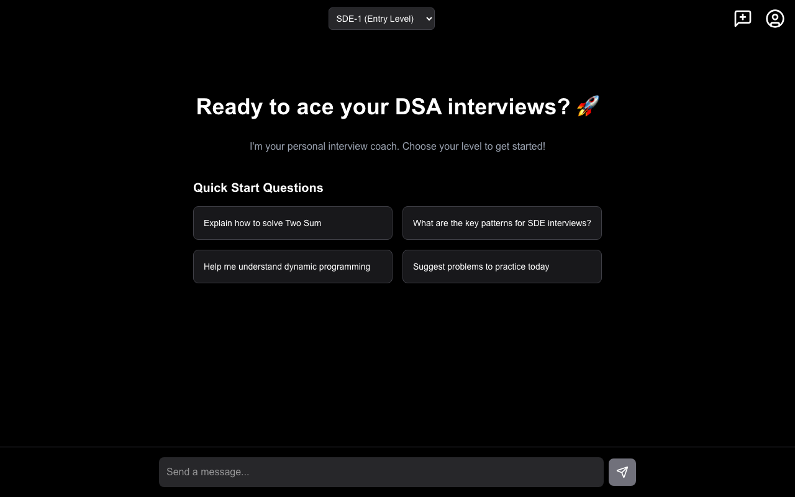
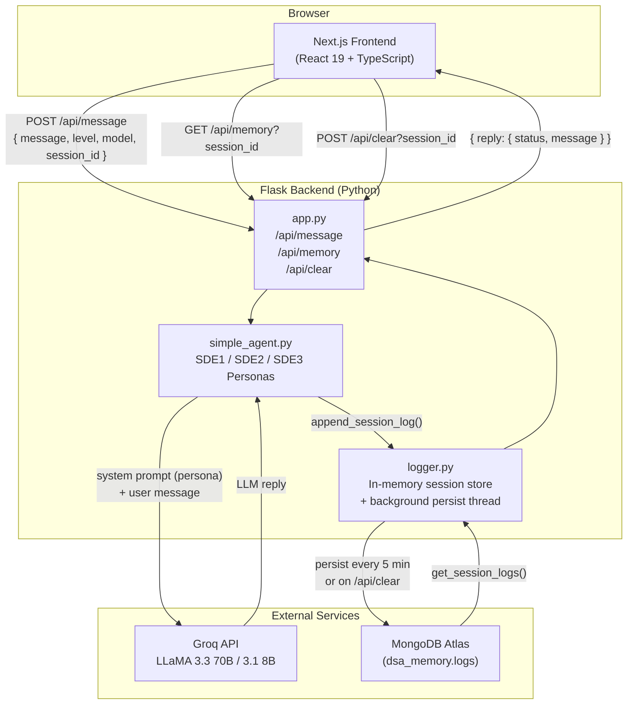

<div align="center">

# 🤖 dBot — DSA Interview Assistant

**An AI-powered coding interview coach that adapts to your seniority level**

[](https://python.org)
[](https://nextjs.org)
[](https://typescriptlang.org)
[](https://mongodb.com)
[](https://groq.com)
[](LICENSE)

[**Live Demo**](https://my-dbot.vercel.app) · [Report Bug](https://github.com/divyadhimaan/dsa-progress-chatbot/issues) · [Request Feature](https://github.com/divyadhimaan/dsa-progress-chatbot/issues)

</div>

---

## Overview

dBot is a conversational AI coach for software engineering interview prep. Unlike generic chatbots, it selects a **tailored persona** based on your target role — SDE-1, SDE-2, or SDE-3 — so every response matches the depth, vocabulary, and expectations of the interview level you're preparing for.

Ask it to explain a concept, walk through a LeetCode problem, or discuss system design trade-offs. Conversations are persisted per session in MongoDB, so you can pick up where you left off.

---

## Screenshot



---

## Features

| Feature | Description |
|---|---|
| 🎯 **Three SDE personas** | Entry, Mid, and Senior coaching styles — different depth, tone, and topic focus |
| ⚡ **Dual model support** | Switch between LLaMA 3.3 70B (powerful) and LLaMA 3.1 8B (fast) mid-session |
| 💬 **Session memory** | Full conversation history persisted to MongoDB; resume anytime |
| 📝 **Markdown responses** | Code blocks, tables, and formatted explanations rendered inline |
| 🔄 **Background persistence** | A cron thread flushes in-memory logs to MongoDB every 5 minutes |
| 🌐 **CORS-ready** | Configured for local dev and Vercel production out of the box |

---

## Architecture



**Request lifecycle:**
1. User picks an SDE level and types a message in the chat UI
2. Frontend sends `POST /api/message` with `{ message, level, model, session_id }`
3. Backend selects the matching persona from `simple_agent.py` and calls the Groq API
4. The reply is appended to in-memory session logs and returned to the UI
5. A background thread persists all sessions to MongoDB every 5 minutes; a manual "New Chat" triggers an immediate flush

---

## Tech Stack

### Frontend
| | Library | Purpose |
|---|---|---|
| ⚛️ | Next.js 19 + React 19 | Framework and rendering |
| 🟦 | TypeScript 5 | Type safety |
| 🎨 | Tailwind CSS v4 + MUI | Styling and UI components |
| 📝 | react-markdown | Render LLM markdown in chat |
| 🔌 | axios | HTTP client for API calls |
| 🔔 | notistack | Toast notifications |

### Backend
| | Library | Purpose |
|---|---|---|
| 🐍 | Flask | Web framework and routing |
| 🔐 | flask-cors | Cross-origin request handling |
| 🤖 | Groq API (HTTP) | LLaMA inference |
| 🍃 | pymongo + certifi | MongoDB client with TLS |
| ⚙️ | python-dotenv | Environment configuration |

---

## Getting Started

### Prerequisites

- **Node.js** 18+
- **Python** 3.8+
- **MongoDB** instance — [MongoDB Atlas free tier](https://www.mongodb.com/cloud/atlas) works fine
- **Groq API key** — [get one here](https://console.groq.com) (free)

### 1 — Clone

```bash
git clone https://github.com/divyadhimaan/dsa-progress-chatbot.git
cd dsa-progress-chatbot
```

### 2 — Environment

Create a `.env` file in the **project root**:

```env
# Required
GROQ_API_KEY=your_groq_api_key_here
MONGO_URI=your_mongodb_connection_string

# Optional (defaults to 5001)
BACKEND_PORT=5001
```

### 3 — Install dependencies

```bash
# Backend
pip install -r backend/requirements.txt

# Frontend
cd frontend && npm install
```

### 4 — Run

Open two terminals:

```bash
# Terminal 1 — backend (from project root)
python3 backend/app.py
```

```bash
# Terminal 2 — frontend
cd frontend && npm run dev
```

Visit **[http://localhost:3000](http://localhost:3000)** — the backend runs on port 5001.

---

## SDE Personas

Each level selects a distinct system prompt that shapes the depth, vocabulary, and expectations of every response.

<details>
<summary><strong>SDE-1 · Entry Level</strong> (fresh grads, 0–2 yrs)</summary>

**Topics:** Arrays, Strings, Linked Lists, Stacks, Queues, Hash Tables, Basic Trees/Graphs, Sorting, Big-O basics, Easy–Medium LeetCode

**Style:** Patient and encouraging — breaks problems into small steps, uses analogies, gives hints before full solutions, celebrates progress.
</details>

<details>
<summary><strong>SDE-2 · Mid Level</strong> (2–5 yrs experience)</summary>

**Topics:** Advanced Trees, Dijkstra/Bellman-Ford, Union-Find, Dynamic Programming, KMP/Trie, Sliding Window, Greedy, Bit Manipulation, Medium–Hard LeetCode, basic System Design

**Style:** Technical and trade-off-focused — discusses multiple solutions, optimizes for time/space, challenges edge-case thinking.
</details>

<details>
<summary><strong>SDE-3 · Senior Level</strong> (5+ yrs, staff/principal track)</summary>

**Topics:** Advanced DP (bitmask, state machine), Network Flow, Fenwick Trees, Suffix Arrays, Computational Geometry, Hard/Expert LeetCode, Distributed Systems, Architecture, Production trade-offs

**Style:** Expert peer — expects optimal solutions upfront, debates architecture decisions, discusses failure modes and scalability at scale.
</details>

---

## API Reference

### `POST /api/message`
Send a message and receive an AI reply.

**Request body:**
```json
{
  "message": "Explain binary search",
  "level": "SDE1",
  "model": "llama-3.3-70b-versatile",
  "session_id": "550e8400-e29b-41d4-a716-446655440000"
}
```

**Response:**
```json
{
  "reply": {
    "status": "ok",
    "message": "Binary search divides the search space in half each iteration..."
  }
}
```

---

### `GET /api/memory?session_id=<id>`
Retrieve the full conversation history for a session.

**Response:** Array of `{ timestamp, user_input, response }` objects.

---

### `POST /api/clear?session_id=<id>`
Flush the session to MongoDB and reset in-memory history (triggered by "New Chat").

---

### `GET /healthy`
Health check — returns `200 OK`.

---

## Project Structure

```
dsa-progress-chatbot/
├── backend/
│   ├── app.py              # Flask app — routes and CORS config
│   ├── simple_agent.py     # Groq API client + SDE_PERSONAS definitions
│   ├── logger.py           # In-memory session store + MongoDB persistence
│   └── requirements.txt
├── frontend/
│   ├── src/
│   │   ├── app/
│   │   │   ├── chat/
│   │   │   │   └── page.tsx    # Main chat interface
│   │   │   ├── layout.tsx
│   │   │   └── page.tsx        # Root redirect
│   │   └── components/
│   │       └── SnackbarProviderWrapper.tsx
│   └── package.json
├── .env                    # Not committed — see Getting Started
└── README.md
```

---

## Customization

**Change a persona** — edit `SDE_PERSONAS` in [`backend/simple_agent.py`](backend/simple_agent.py):

```python
SDE_PERSONAS = {
    "SDE1": "Your custom coaching instructions...",
    ...
}
```

**Add a new level** — add an entry to `SDE_PERSONAS`, then add the level to the dropdown array in `frontend/src/app/chat/page.tsx`.

**Swap the model** — any model from [Groq's supported list](https://console.groq.com/docs/models) works; update the models array in the frontend or pass it directly in the API request.

---

## Deployment

### Backend — Render / Railway / Fly.io

1. Set env vars: `GROQ_API_KEY`, `MONGO_URI`, `BACKEND_PORT`
2. Deploy the `backend/` directory
3. Start command: `gunicorn app:app`

### Frontend — Vercel

1. Set `NEXT_PUBLIC_API_BASE_URL` to your backend's public URL
2. Deploy the `frontend/` directory
3. Build command: `npm run build`

Don't forget to add your Vercel domain to the `CORS` allowlist in [`backend/app.py`](backend/app.py).

---

## Contributing

Issues and PRs are welcome! If you add a new persona level, an interesting prompt tweak, or a UI improvement — open a pull request.

---

## License

MIT — use it freely for your interview prep.

---

<div align="center">
<sub>Built with ☕ and a healthy fear of dynamic programming.</sub>
</div>
